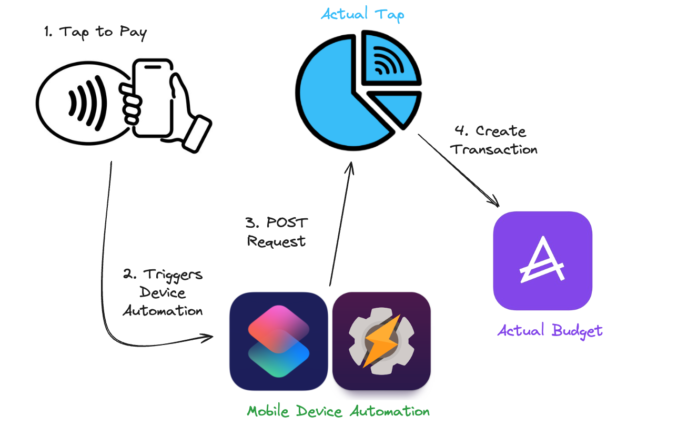

<h1 align="center">ActualTap-Py</h1>

    
     
    <i><b>Heavily inspired by <a href="https://github.com/MattFaz/actualtap">Actual Tap</a> but written in python using <a href="https://github.com/bvanelli/actualpy">Actualpy</a> and a added a few enhancements.</i></b>
     
    Special thanks to <a href=https://github.com/MattFaz> @MattFaz</a> for the initial Actual Tap work!
     
    <i>Automatically create transactions in <a href="https://github.com/actualbudget/actual">Actual Budget</a> when you use Tap-to-Pay on a mobile device</i>

## Contents

-   [Overview](#overview)
-   [Run the App](#run-the-app)
-   [iOS Setup](#ios-setup)
-   [Android Setup](#android-setup)

# Overview

Actual Tap uses FastAPI that utilises the <a href="https://github.com/bvanelli/actualpy">Actualpy</a> to create transactions.

The primary purpose of Actual Tap is receive a POST request from mobile devices _(.e.g iOS Shortcuts)_ when a Tap to Pay transaction is made. Once the POST request is received Actual Tap will POST the Name and Amount to Actual Budget.

In addition, there is a <a href="config/config.yml.sample">configuration file</a> that allows you to map between the Tap to Pay account and your Actual Account ID.

Ideal flow:

1. Mobile device is tapped to make a purchase
2. Automation on mobile device is triggered
    - Recommended apps are [Shortcuts](https://apps.apple.com/us/app/shortcuts/id915249334) (iOS) or [Tasker](https://play.google.com/store/apps/details?id=net.dinglisch.android.taskerm&pcampaignid=web_share) (Android)
3. POST request containing transaction information _(merchant, amount, and card)_ is sent to Actual Tap
4. Actual Tap creates the transaction in Actual Budget

    

**Notes:** This is in active / heavy development, issues, pull requests, feature requests etc. are welcome.

---

## Running the App

To run Actual Tap locally _(i.e. for development or not containerised)_:

-   `$ cp config/config.yml.sample config/config.yml`
-   Edit the `config.yml` file accordingly
-   Run locally using `uvicorn main:app --host 0.0.0.0 --port 8000`

To run Actual Tap in docker ensure you edit variables in the `docker-compose.yml` file.

-   **Note:** You will also need to update the volumes path

The app will be running on port `8000`

## iOS Setup

1. Import these 2 shortcuts:
    - <a href="https://www.icloud.com/shortcuts/eb9ab397923540fe9be7be878138ac4d">Wallet Transactions to JSON - Shared</a>
    - <a href="https://www.icloud.com/shortcuts/a983e1b1d72b4a3ba0580b722d61013c">Wallet to ActualTap - Shared</a>
2. Open Shortcuts app
3. Edit the <a href="https://www.icloud.com/shortcuts/a983e1b1d72b4a3ba0580b722d61013c">Wallet to ActualTap - Shared</a> shorcut
    - Under the Dictionary block, modify the following values
       | **Key**    | **Text**                             | **Example**                             |
       | -----------| ------------------------------------ | --------------------------------------- |
       | `ActualTap URL`   | The URL of your ActualTap instance followed by `/transactions/`  |  https://actualtap-api.com/transactions/                    |
       | `API Key`     | The `api_key` defined in your <a href="config/config.yml.sample">configuration file</a> |    527D6AAA-B22A-4D48-9DC8-C203139E5531  |
4. Import these two automations:
5. Select Automations
6. Create new Automation to Run Immediately
7. When:
    - I tap any of x Wallet passes or payment cards
8. Do:
    - Receive transaction as input
    - Dictionary

       | **Key**    | **Text**                             |
       | -----------| ------------------------------------ |
       | `amount`   | (_shortcut Input_ -> _Amount_)       |
       | `card`     | (_shortcut Input_ -> _Card or Pass_) |
       | `merchant` | (_shortcut Input_ -> _Merchant_)     |
       | `name`     | (_shortcut Input_ -> _Name_)         |

    - Run shortcut -> Wallet Transactions to JSON - Shared
    - Run shortcut -> Wallet to ActualTap - Shared

## Android Setup

TBC
