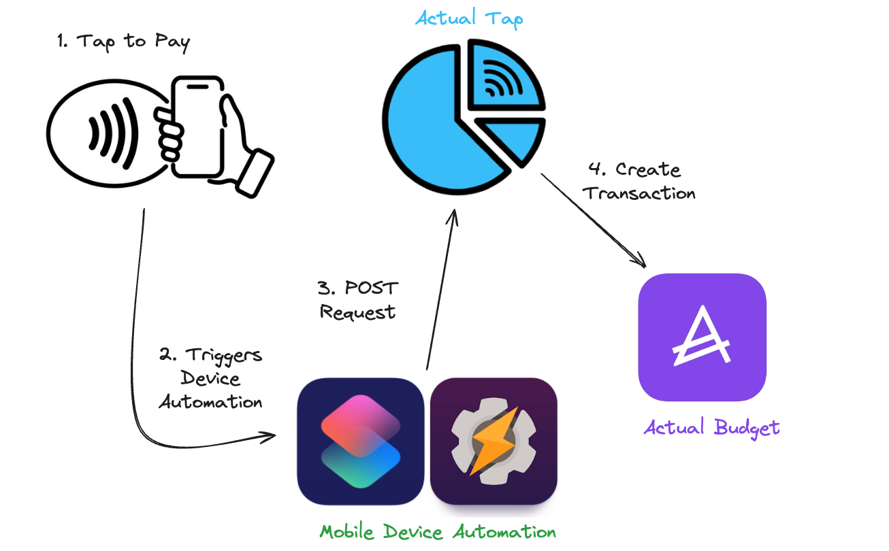

<h1 align="center">ActualTap-Py</h1>

<p align="center">
    
    <br>
    Automatically create <a href="https://github.com/actualbudget/actual">Actual Budget</a> transactions from mobile Tap-to-Pay events.
    <br>
    A Python implementation inspired by <a href="https://github.com/MattFaz/actualtap">Actual Tap</a>, built with <a href="https://github.com/bvanelli/actualpy">actualpy</a> and FastAPI.
</p>

## Overview

ActualTap-Py receives authenticated transaction requests from mobile automations such as iOS Shortcuts, then creates the transactions in Actual Budget. Card names can be mapped to Actual account IDs in the configuration file, keeping the mobile workflow simple.

1. A mobile payment is made.
2. A mobile automation captures the transaction details.
3. The automation sends a request to ActualTap-Py.
4. ActualTap-Py creates the transaction in Actual Budget.

<p align="center">
    
</p>

## Requirements

- Python 3.12 or Docker
- An accessible Actual Budget server, budget, and account IDs
- A mobile automation client such as [Shortcuts](https://apps.apple.com/us/app/shortcuts/id915249334) on iOS

## Configuration

Create your configuration file from the included template:

```sh
cp config/config.yml.sample config/config.yml
```

Update [config/config.yml](config/config.yml) with your Actual Budget details. Do not commit this file: it contains credentials.

| Setting | Purpose |
| --- | --- |
| `api_key` | Shared secret sent in the `X-API-KEY` request header. |
| `actual_url` | URL of the Actual Budget server. |
| `actual_password` | Actual Budget server password. |
| `actual_encryption_password` | Optional end-to-end encryption password. |
| `actual_budget` | Budget name or Sync ID. |
| `actual_default_account_id` | Fallback Actual account ID. |
| `actual_backup_payee` | Payee used when a merchant is unavailable. |
| `account_mappings` | Mapping from mobile card name to Actual account ID. Card names are case-sensitive. |
| `log_level` | Application log level; defaults to `INFO`. |

To find an Actual account ID, select the account in Actual and copy its UUID from the URL. The key in `account_mappings` must exactly match the card name shown in Wallet's Card Details.

## Run Locally

Install the dependencies and start the API:

```sh
pip install -r requirements.txt
pip install -e .
fastapi run main.py --host 0.0.0.0 --port 8000
```

The service listens on port `8000`. Interactive API documentation is available at `/docs`, but it also requires the API key header.

## Run With Docker

1. Copy and configure [config/config.yml.sample](config/config.yml.sample).
2. In [docker-compose.yml](docker-compose.yml), replace `/your/path/here` with the absolute path to the directory containing `config.yml`.
3. Start the service:

```sh
docker compose up -d
```

The container reads `/config/config.yml` and exposes port `8000`. View its logs with `docker compose logs -f actualtap-py`.

## API

All endpoints require the following headers:

```http
X-API-KEY: your-api-key
Content-Type: application/json
```

Send one transaction, or an array of transactions, to `POST /transactions` (a trailing slash is also accepted).

| Field | Required | Description |
| --- | --- | --- |
| `account` | Yes | Actual account name or ID. |
| `amount` | No | Decimal transaction amount; defaults to `0`. Comma decimal separators are accepted. |
| `date` | No | Date in `YYYY-MM-DD`, `MMM DD, YYYY`, or `MMM DD YYYY`; defaults to today. |
| `payee` | No | Merchant or payee name. |
| `notes` | No | Transaction notes. |
| `cleared` | No | Whether the transaction is cleared; defaults to `false`. |
| `type` | No | Transaction type: `payment` (expense, default) or `deposit` (income/refund). |
| `latitude`, `longitude` | No | Payee coordinates. Supply both values together. |
| `location` | No | Alternative coordinate pair: `{ "lat": ..., "lng": ... }`, `{ "latitude": ..., "longitude": ... }`, or a `latitude,longitude` string. |

Use either `latitude` and `longitude` or `location`; do not send both. When both formats are present, `latitude` and `longitude` take precedence.

Example expense:

```sh
curl -X POST http://localhost:8000/transactions \
    -H 'X-API-KEY: your-api-key' \
    -H 'Content-Type: application/json' \
    -d '{
        "account": "Sample Credit Card",
        "amount": 10.50,
        "payee": "Starbucks",
        "date": "2026-08-30",
        "latitude": 37.7749,
        "longitude": -122.4194
    }'
```

Example deposit (income / refund):

```sh
curl -X POST http://localhost:8000/transactions \
    -H 'X-API-KEY: your-api-key' \
    -H 'Content-Type: application/json' \
    -d '{
        "account": "Checking Account",
        "amount": 2500.00,
        "type": "deposit",
        "payee": "Employer",
        "date": "2026-08-30",
        "notes": "Payroll"
    }'
```

Payee locations are stored when supported by the connected Actual Budget version. A location is only added when that payee has no existing location within 500 metres.

## iOS Setup

The iOS workflow has two parts: shortcuts that transform and send the transaction, and a Wallet automation that runs those shortcuts after a payment.

### Import and Configure the Shortcuts

1. Import [Wallet Transactions to JSON](https://www.icloud.com/shortcuts/6cb37c97dc4d4e089f73def466c7b309) and [Wallet to ActualTap](https://www.icloud.com/shortcuts/969a903b85774b08b139ef211c9517b9).
2. Open **Wallet to ActualTap - Shared** in Shortcuts and find its Dictionary block.
3. Set `ActualTap URL` to the publicly reachable address of this service, including `/transactions/`, for example `https://actualtap.example.com/transactions/`.
4. Set `API Key` to the value of `api_key` in `config/config.yml`.

### Create the Wallet Automation

1. Open **Shortcuts**, select **Automation**, then tap **+**.
2. Tap **Create Personal Automation** if Shortcuts asks which automation type to create, then select **Wallet** as the trigger.
3. Under **When**, select **I Tap**. Choose every card or pass that should create a transaction, select all applicable transaction categories, then tap **Next**.
4. Select **Run Immediately** and turn off **Notify When Run**, then tap **Next**.
5. Choose **New Blank Automation**. Tap **Add Action**, search for **Dictionary**, and select the **Dictionary** action.
6. The Dictionary starts with one key/value row. Set its key to `amount`, then use **Add new item** to create the `card`, `merchant`, and `name` rows.
7. Set each value from the Wallet event: tap an empty value field, choose **Select Variable**, choose **Shortcut Input**, then tap the inserted **Shortcut Input** variable and select the Wallet property in the table below. Repeat this for all four rows.

| Dictionary key | Value | Wallet property |
| --- | --- | --- |
| `amount` | Shortcut Input variable | Amount |
| `card` | Shortcut Input variable | Card or Pass |
| `merchant` | Shortcut Input variable | Merchant |
| `name` | Shortcut Input variable | Name |

The **Wallet Transactions to JSON - Shared** shortcut obtains and adds latitude and longitude; do not add location fields to this Dictionary.

Keep the Wallet field extraction in the automation. This lets the shared shortcuts remain reusable: the first enriches and serializes the Dictionary, and the second sends it to ActualTap-Py.

8. Tap the search bar below the Dictionary, search for **Run Shortcut**, and add the action. Tap the blue **Shortcut** label and select **Wallet Transactions to JSON - Shared**.
9. Tap the arrow on the **Run Shortcut** action to show its options. Tap **Input**, select **Select Variable**, and choose the Dictionary output.
10. Add another **Run Shortcut** action. Select **Wallet to ActualTap - Shared**, expand its options, then set **Input** to the output of **Wallet Transactions to JSON - Shared**.
11. Review the action order: **Dictionary**, **Wallet Transactions to JSON - Shared**, then **Wallet to ActualTap - Shared**. Tap **Done** to save the automation.

### Verify the Automation

Make a small test payment with a selected card. Open Actual Budget and confirm that the account, payee, and amount are correct. If no transaction appears, open the automation in Shortcuts to confirm that the `ActualTap URL` ends in `/transactions/`, then check the ActualTap-Py logs for the request and any validation error.

### Prevent Duplicate Transactions

Create an empty file named `wallet.txt` at the root of iCloud Drive. In the Files app, set the file to **Keep Downloaded**. The shared shortcuts use this file to track recently processed Wallet events.

ActualTap-Py must be reachable from the mobile device. Put it behind HTTPS and restrict public access appropriately.

## Troubleshooting

- `403 Could not validate credentials`: confirm the `X-API-KEY` header exactly matches `api_key`.
- Account errors: confirm the card name and `account_mappings` key match exactly, and that the mapped UUID is an Actual account ID.
- Configuration errors: local runs require `config/config.yml`; containers require the mounted `/config/config.yml`.
- Invalid date errors: use one of the documented date formats.

## Development

Run the test suite with:

```sh
pytest
```

This project is under active development. Issues, pull requests, and feature requests are welcome.
